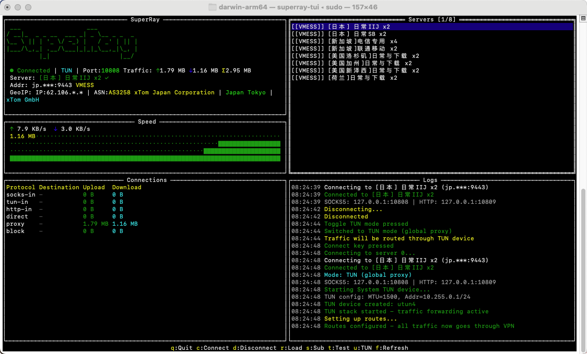

# SuperRay-TUI

基于终端的代理客户端，提供直观的 TUI 界面管理代理连接。



## 功能特性

- 终端图形界面 (TUI)
- 支持多种协议 (VMess, VLESS, Shadowsocks, Trojan)
- 订阅管理和自动更新
- 服务器延迟测试
- 实时流量统计
- GeoIP 智能分流
- 跨平台支持 (macOS, Linux, Windows)

## 依赖库

- [xray-core](https://github.com/XTLS/Xray-core) - 代理核心引擎
- SuperRay - xray-core 的 C 封装库
- [tview](https://github.com/rivo/tview) - Go TUI 框架
- [tcell](https://github.com/gdamore/tcell) - 终端控制库

## 快速开始

### 下载

从 [Releases](https://github.com/opinework/SuperRay-TUI/releases) 下载对应平台的安装包：

| 平台 | 文件 |
|------|------|
| macOS (Apple Silicon) | `superray-tui-1.0.0-darwin-arm64.tar.gz` |
| macOS (Intel) | `superray-tui-1.0.0-darwin-amd64.tar.gz` |
| macOS (通用) | `superray-tui-1.0.0-darwin-universal.tar.gz` |
| Linux (x64) | `superray-tui-1.0.0-linux-amd64.tar.gz` |
| Linux (ARM64) | `superray-tui-1.0.0-linux-arm64.tar.gz` |
| Windows (x64) | `superray-tui-1.0.0-windows-amd64.zip` |

### 安装

```bash
# macOS/Linux
tar -xzf superray-tui-1.0.0-darwin-arm64.tar.gz
cd superray-tui

# Windows
# 解压 zip 文件即可
```

### 配置

```bash
cp .env.example .env
# 编辑 .env 设置订阅地址
```

`.env` 配置项：

```bash
SUPERRAY_SUB_URL=https://your-subscription-url  # 订阅地址
SUPERRAY_LOCAL_PORT=10808                       # SOCKS5 端口
SUPERRAY_GEO_PATH=./geoip                       # GeoIP 数据目录
DIRECT_COUNTRIES=cn                             # 直连国家
```

### 运行

```bash
# 普通模式
./superray-tui

# TUN 模式 (全局代理，需要管理员权限)
sudo ./superray-tui
```

## 界面操作

| 按键 | 功能 |
|------|------|
| `↑/↓` 或 `k/j` | 选择服务器 |
| `Enter` / `c` | 连接 |
| `d` | 断开连接 |
| `t` | 测试延迟 |
| `r` | 刷新订阅 |
| `s` | 设置订阅 |
| `u` | 切换 TUN 模式 |
| `q` | 退出 |

## 代理设置

连接成功后，配置系统使用代理：

- **SOCKS5**: `127.0.0.1:10808`
- **HTTP**: `127.0.0.1:10809`

## 从源码编译

### 环境要求

- Go 1.21+
- CGO 支持
- Zig (交叉编译)

### 编译命令

```bash
# 当前平台
make build

# macOS 全架构
make darwin-all

# 全平台
make package-all

# 查看所有命令
make help
```

## 项目结构

```
SuperRay-TUI/
├── main.go                 # 主程序
├── pkg/superray/           # CGO 绑定
├── third_party/superray/   # SuperRay 库
│   ├── include/            # 头文件
│   ├── lib/                # 动态库
│   └── geoip/              # GeoIP 数据
├── build/                  # 编译输出
├── dist/                   # 打包输出
└── docs/                   # 文档
    ├── BUILD.md            # 编译指南
    ├── INSTALL.md          # 安装指南
    └── USAGE.md            # 使用说明
```

## 文档

- [编译指南](docs/BUILD.md)
- [安装指南](docs/INSTALL.md)
- [使用说明](docs/USAGE.md)

## 联系方式

- Telegram 频道: [@JinGoAccelerator](https://t.me/JinGoAccelerator)
- Telegram 群组: [@JinGoVPN](https://t.me/JinGoVPN)

## 许可证

MIT License
